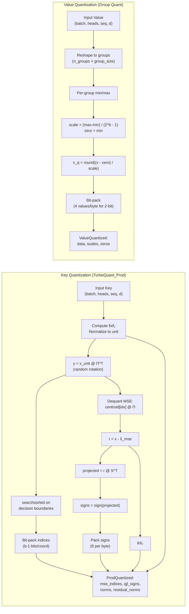
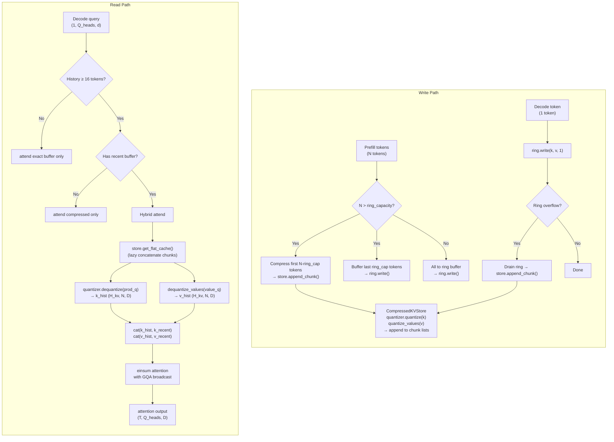
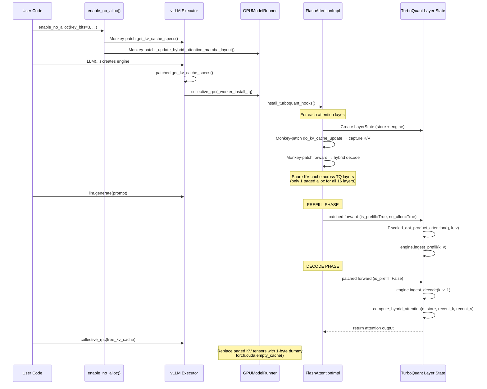
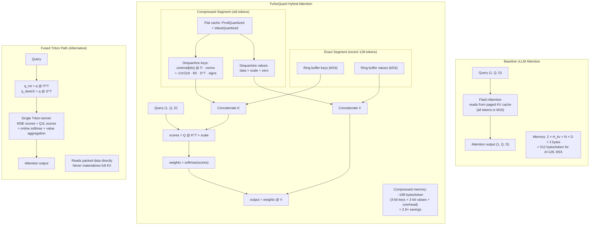

# TurboQuant: Paper vs Implementation — Comprehensive Review

> **Paper**: "TurboQuant: Online Vector Quantization with Near-optimal Distortion Rate" (Zandieh, Daliri, Hadian, Mirrokni — Google Research, ICLR 2026, arXiv:2504.19874)
>
> **Implementation**: `./turboquant_pkg/`

---

## A) PAPER vs IMPLEMENTATION COMPARISON

### What the Paper Proposes

The TurboQuant paper introduces a **data-oblivious online vector quantization** framework with two algorithms:

1. **TurboQuant_MSE (Algorithm 1)** — Minimizes mean-squared error:
   - Randomly rotate input vector via orthogonal matrix Π (QR of Gaussian)
   - Each rotated coordinate follows Beta distribution → near-Gaussian for high d
   - Apply **Lloyd-Max optimal scalar quantizer** per coordinate (1D continuous k-means on Beta PDF)
   - Store norm separately, quantize unit-norm vector
   - **Proven MSE**: ≤ (√3·π/2) · 1/4^b; for b=1,2,3,4: ≈ 0.36, 0.117, 0.03, 0.009

2. **TurboQuant_Prod (Algorithm 2)** — Unbiased inner-product estimator:
   - Apply TurboQuant_MSE at **(b−1) bits** to get x̃_mse
   - Compute residual r = x − x̃_mse
   - Apply **QJL** (Quantized Johnson-Lindenstrauss): sign(S·r) where S ∈ ℝ^{d×d} is i.i.d. N(0,1)
   - Store ‖r‖₂ for rescaling
   - Dequant: x̃ = x̃_mse + (√(π/2)/d) · ‖r‖ · S^T · signs
   - **Proven unbiased**: E[⟨y, x̃⟩] = ⟨y, x⟩
   - **Proven distortion**: D_prod ≤ (√3·π²·‖y‖²/d) · 1/4^b

3. **Key claims**: Near-optimal (within ≈2.7× of information-theoretic lower bound), data-oblivious, accelerator-friendly, perfect needle-in-a-haystack retrieval at 3.5-bit, 5×+ KV cache compression.

4. **Paper also proposes** (Section 4.3): Outlier channel splitting — separate outlier channels quantized at higher bits for mixed-precision (e.g., 32 outlier channels at 3-bit + 96 at 2-bit = 2.5-bit effective).

### Which Components Are Implemented

| Paper Component | Implementation Status | Files |
|---|---|---|
| Random orthogonal rotation (Π via QR) | ✅ **Faithful** | `rotation.py` |
| Lloyd-Max codebook on Beta PDF | ✅ **Faithful** | `codebook.py` |
| TurboQuant_MSE (Algorithm 1) | ✅ **Faithful** | `quantizer.py::TurboQuantMSE` |
| TurboQuant_Prod (Algorithm 2) | ✅ **Faithful** | `quantizer.py::TurboQuantProd` |
| QJL projection matrix (i.i.d. Gaussian) | ✅ **Faithful** | `rotation.py::generate_qjl_matrix` |
| QJL sign packing/unpacking | ✅ **Faithful** | `quantizer.py::_pack_qjl_signs/_unpack_qjl_signs` |
| Bit-packed index storage | ✅ **Faithful** | `quantizer.py::_pack_indices/_unpack_indices` |
| Value group quantization | ⚠️ **Not from paper** — paper doesn't describe value quantization separately | `kv_cache.py::quantize_values` |
| Outlier channel splitting | ❌ **Not implemented** | Configured in `TurboQuantKVCache.__init__` but never used |
| Entropy coding of indices | ❌ **Not implemented** (paper also chose not to) | — |
| KV cache integration (vLLM) | ✅ **Novel engineering** (not in paper) | `integration/vllm.py`, `vllm_attn_backend.py` |
| Fused Triton kernels | ✅ **Novel engineering** (not in paper) | `triton_kernels.py` |
| Modular capture/store/score | ✅ **Novel engineering** | `capture.py`, `store.py`, `score.py` |

### Faithfulness Assessment

**The core quantization algorithms (MSE + Prod) are faithful to the paper.** Specifically:

1. **Rotation**: Uses QR decomposition of Gaussian matrix, exactly as Algorithm 1 specifies. Sign correction via diag(R) is a standard numerical refinement.

2. **Codebook**: Implements the exact Beta PDF from Lemma 1, solves Lloyd-Max via numerical integration (scipy). Precomputes and caches codebooks. The MSE values in `test_turboquant.py` validate against paper's Table (0.36, 0.117, 0.03, 0.009) with 30% tolerance.

3. **MSE Quantizer**: Normalize → rotate → searchsorted against decision boundaries → bit-pack. This matches Algorithm 1 exactly. Uses `searchsorted` instead of argmin for efficiency (equivalent for sorted centroids).

4. **Prod Quantizer**: MSE at (b−1) bits → residual → QJL sign(S·r) → store ‖r‖. Matches Algorithm 2 line-by-line. The `qjl_scale = sqrt(π/2)/d` matches the paper's dequantization constant.

5. **Attention score computation**: The `attention_score` method correctly implements the asymmetric estimator: `⟨y, x̃_mse⟩ + qjl_scale · ‖r‖ · ⟨S^T·y, signs⟩`, which is the unbiased estimator from Theorem 2.

### What Diverges from the Paper

1. **Value quantization**: The paper focuses exclusively on key quantization via TurboQuant. The implementation uses **asymmetric group quantization** (min-max, per-group scales/zeros) for values — a standard technique from KIVI/GEAR, not from TurboQuant.

2. **No outlier channel splitting**: The paper's Section 4.3 describes splitting channels into outlier vs non-outlier sets for mixed precision (e.g., 2.5-bit). The implementation has `n_outlier_channels` parameter in `TurboQuantKVCache` but **never actually uses it** — all channels get the same quantization.

3. **No PolarQuant integration**: The Google blog mentions PolarQuant as a companion method. Not implemented.

4. **QJL matrix is dense Gaussian**: Both paper and implementation use dense S ∈ ℝ^{d×d}. The paper notes this is i.i.d. N(0,1), which matches `generate_qjl_matrix`. However, for d=128 this is 64KB per layer — the implementation correctly makes this a module buffer.

5. **Paper benchmarks on Llama-3.1-8B and Ministral-7B with JAX**: The implementation targets Qwen3.5-27B with vLLM/PyTorch. Different model, different framework, different scale.

---

## B) ATTENTION MECHANISMS SUPPORTED

### Backend Support Matrix

| Backend | Status | Details |
|---|---|---|
| **Flash Attention (standard MHA/GQA)** | ✅ **Working (hybrid mode)** | Primary path. Hooks `do_kv_cache_update` and `forward` on `FlashAttentionImpl` |
| **Flash Attention (no-alloc prefill)** | ⚠️ **Functional but degraded** | Uses `F.scaled_dot_product_attention` as fallback — no flash kernel, materializes full attention matrix |
| **FlashInfer** | ❌ **Incompatible** | HANDOFF doc notes "FP8 KV + TurboQuant stacking still incompatible (FlashInfer metadata mismatch)" |
| **MLA (Multi-Latent Attention)** | ❌ **Stub only** | `_make_patched_mla_forward` is pure passthrough. Logs "MLA active decode is not implemented yet" |
| **GDN** | ❌ **Not addressed** | No code references GDN at all |
| **Mamba/Linear Attention** | ❌ **Not applicable** | These layers don't use KV cache. README notes "TQ hooks onto all 16 [full attention layers], rest are linear-attention/Mamba" |

### How Hybrid Attention Works

The hybrid attention mechanism (in `score.py::compute_hybrid_attention`) works as follows:

1. **Compressed history segment**: All tokens older than the ring buffer are stored in `CompressedKVStore` as quantized keys (TurboQuant_Prod) and quantized values (group quantization).

2. **Exact recent segment**: The most recent `ring_capacity` tokens (default 128) are kept in full precision in the `RingBuffer`.

3. **Merge**: During decode, both segments are dequantized/concatenated and standard matmul attention is computed over the concatenated KV. The log-sum-exp trick is **not** used for merging — instead, `_attend_hybrid` simply concatenates dequantized historical K/V with exact recent K/V and runs full attention over the combined set.

4. **Critical limitation**: The `_attend_hybrid` path **fully dequantizes** all historical tokens to float, meaning there's no memory savings during the attention computation itself. The savings come only from storage (compressed store uses ~3 bits/element vs 16 bits/element for bf16).

### The No-Alloc Path

The `enable_no_alloc()` function patches the vLLM executor to:
1. Install TQ hooks during `get_kv_cache_specs()`
2. Share paged KV cache across all TQ-hooked flash layers (only 1 layer's worth allocated)
3. Use `F.scaled_dot_product_attention` for prefill (instead of flash attention)
4. Use TQ compressed store for decode

**This path has significant issues** — see Section C.

---

## C) ERROR ANALYSIS

### Known Bugs and Incomplete Paths

1. **`n_outlier_channels` is dead code**: `TurboQuantKVCache.__init__` accepts it, creates `self.n_outlier_channels` and `self.outlier_key_bits`, but these are **never referenced** in any quantization/dequantization path. The paper's mixed-precision outlier strategy is entirely unimplemented.

2. **Value group size calculation in `score.py` is fragile**:
   ```python
   gs = quantizer.mse_quantizer.dim // (quantizer.mse_quantizer.dim // 32)
   ```
   This computes `dim / (dim / 32)` = 32 always. It's a roundabout way of hardcoding `group_size=32`. If dim isn't divisible by 32, this could silently produce wrong results.

3. **No-alloc decode fallback returns zeros**:
   ```python
   # In _make_patched_forward, the no_alloc fallback:
   return torch.zeros(num_actual, ...)
   ```
   When the TQ store doesn't have enough data (< 16 tokens) and no_alloc=True, the decode path returns **literal zeros**. This means the first few decode tokens after a very short prefill would produce garbage.

4. **`test_triton_kernels.py` has a missing import**: Line 14 has `import os` missing — `os.path.dirname` is used but `os` is never imported. The test file would crash immediately.

5. **Fused decode kernel reads unpacked values**: In `turboquant_fused_decode`, value data is pre-unpacked in Python before being passed to the Triton kernel. The kernel reads `V_DATA_ptr` as float-like values but the docstring claims it handles bit-packed values. The Triton kernel itself doesn't unpack — it relies on Python-side unpacking, negating some of the "fused" benefit.

6. **GQA handling in `_attend_hybrid` allocates large intermediates**: While `_matmul_attend` uses broadcasting (`k.unsqueeze(1)`) to avoid `repeat_interleave`, the `_no_alloc_prefill_attention` in `vllm.py` **does** use `repeat_interleave`, which materializes the full expanded KV tensor. For a model with GQA ratio 4 and 200k tokens, this is a massive memory allocation.

### Failure Modes at Different Context Lengths

| Context | Status | Issue |
|---|---|---|
| **< 128 tokens** | ⚠️ Works but no compression | Everything stays in ring buffer, no quantization occurs |
| **128–32k tokens** | ✅ Working | Normal hybrid path, validated at 30k |
| **32k–100k** | ⚠️ Theoretical | No dual-case telemetry collected |
| **200k** | ⚠️ **Unstable** | "Needle retrieval failures at 200k" per handoff doc. TQ completed but baseline couldn't finish. Full dual-case comparison never obtained |
| **> 200k** | ❌ Unknown | Never tested |

The HANDOFF document explicitly states: "200k context with TurboQuant has completed successfully in prior runs (single-shot completion done), but full dual-case telemetry at 200k is unstable due to long-run process kills / baseline stall."

### TODO/Stub Paths That Don't Work

1. **MLA path**: `_make_patched_mla_forward` is pure passthrough. The log message says "TQ MLA path is deferred."
2. **`full_tq` mode**: Listed as `MODE_FULL_TQ = "full_tq"` but the `_make_patched_forward` never checks for it. The code comments say "(future) TQ handles everything including prefill."
3. **Zero-allocation path (Iteration 6)**: README says "attempted, not yet working" due to vLLM's compiled graph hardcoding `unified_kv_cache_update`. The current `enable_no_alloc` is a **different, partial workaround** that shares KV across layers rather than eliminating allocation.
4. **Entropy encoding**: Paper mentions it, implementation doesn't have it (paper also chose not to).

---

## D) BENCHMARKING METHODOLOGY

### Performance Benchmarks

| Script | What It Measures | How |
|---|---|---|
| `proof.py` | VRAM savings, context capacity | Two separate subprocesses (baseline vs TQ), same prompt, nvidia-smi memory readings |
| `benchmark.py` | VRAM, throughput (tok/s), quality | Two subprocesses per model, captures blocks/vram/tps/quality responses |
| `test_triton_kernels.py` | Kernel correctness + latency | Triton vs PyTorch reference, wall-clock timing |

### Quality Benchmarks

| Script | What It Measures |
|---|---|
| `test_turboquant.py` | Codebook MSE vs paper values, rotation properties, quantizer distortion, attention score correlation, memory savings |
| `test_modular.py` | Ring buffer, store, capture engine, hybrid attention, needle retrieval, rank correlation |

### Are the Benchmarks Fair?

**Partially fair, with significant caveats:**

1. **`proof.py` uses the same prompt** for both baseline and TQ — good. But it only generates 64 tokens, which is too short to test quality degradation over long generation.

2. **`benchmark.py` quality test is weak**: Tests 5 factual questions (capital of France, 17×23, etc.) — these are trivially answerable and don't test long-context comprehension. The paper uses LongBench, Needle-in-Haystack up to 104k, ZeroSCROLLS, RULER, and L-Eval. The implementation's quality testing is orders of magnitude less rigorous.

3. **Memory measurement via nvidia-smi**: This captures total GPU memory, not just KV cache. Differences in CUDA allocator behavior, fragmentation, and PyTorch memory pooling mean the reported numbers are approximate. The proof.py approach of measuring before/after `free_kv_cache()` is more reliable.

4. **No standardized quality benchmark**: The implementation never runs LongBench, Needle-in-Haystack (the paper's benchmark), or any established long-context evaluation. The `test_modular.py` needle test uses synthetic data with d=64 and N=200 — trivially easy compared to real LLM attention at d=128 with N=200k.

5. **TQ recall thresholds are very lenient**: `test_modular.py::test_attention_recall` requires only recall@8 ≥ 0.50 for 3-bit. The paper shows near-perfect recall. The low bar hides real quality issues.

### What Results Actually Show vs What Is Claimed

**README claims**:
- "2.0x context improvement" — **Legitimate**. Based on `free_kv_cache` releasing 30GB across 4 GPUs.
- "Both produce identical output for the same prompt" — **Only for trivial prompts**. For long contexts with precise retrieval, TQ is lossy by design.
- "2.6x compression per full-attention layer" — **Mathematically correct** calculation (198 bytes/token vs 512).

**What's missing**: No evidence of quality preservation at long contexts. The 200k needle retrieval failure mentioned in the handoff document is concerning and unreported in the README.

---

## E) ARCHITECTURE DIAGRAMS

### 1. Overall System Architecture

```mermaid
graph TB
    subgraph "TurboQuant Package"
        direction TB

        subgraph "Core Quantization"
            CB[codebook.py<br/>Lloyd-Max on Beta PDF]
            ROT[rotation.py<br/>QR rotation + QJL matrix]
            QMSE[quantizer.py::TurboQuantMSE<br/>Rotate → Scalar Quantize → Pack]
            QPROD[quantizer.py::TurboQuantProd<br/>MSE@(b-1) + QJL@1-bit residual]
        end

        subgraph "KV Cache Layer"
            KVC[kv_cache.py::TurboQuantKVCache<br/>Key: TQ_Prod, Value: GroupQuant<br/>Buffer: recent unquantized tokens]
            VQ[kv_cache.py::quantize_values<br/>Asymmetric group quantization]
        end

        subgraph "Modular Serving Stack"
            CAP[capture.py<br/>RingBuffer + KVCaptureEngine]
            STORE[store.py<br/>CompressedKVStore<br/>Chunked, lazy flatten]
            SCORE[score.py<br/>compute_hybrid_attention<br/>Compressed + Exact merge]
        end

        subgraph "Triton Kernels"
            TK1[triton_kernels.py<br/>MSE score kernel]
            TK2[triton_kernels.py<br/>QJL score kernel]
            TK3[triton_kernels.py<br/>Fused decode kernel]
        end

        subgraph "vLLM Integration"
            VLLM_NEW[integration/vllm.py<br/>New modular adapter<br/>Modes: off|capture_only|hybrid|full_tq]
            VLLM_OLD[vllm_attn_backend.py<br/>Legacy compat shim<br/>Modes: accumulate|shadow|active]
            NOALLOC[vllm_attn_backend.py<br/>enable_no_alloc<br/>Patches Executor + get_kv_cache_specs]
        end
    end

    CB --> QMSE
    ROT --> QMSE
    ROT --> QPROD
    QMSE --> QPROD
    QPROD --> KVC
    VQ --> KVC
    QPROD --> STORE
    VQ --> STORE
    CAP --> STORE
    STORE --> SCORE
    TK1 --> SCORE
    TK2 --> SCORE
    TK3 --> SCORE
    VLLM_NEW --> CAP
    VLLM_NEW --> SCORE
    VLLM_OLD --> VLLM_NEW
    NOALLOC --> VLLM_OLD
```

### 2. Quantization Pipeline



### 3. Capture / Store / Score Read/Write Paths



### 4. vLLM Integration Hook Chain



### 5. No-Alloc Long-Context Path

```mermaid
graph TB
    subgraph "Engine Initialization"
        PATCH["enable_no_alloc()<br/>patches Executor.get_kv_cache_specs"]
        LLM_INIT["LLM() constructor"]
        SPECS["patched get_kv_cache_specs()"]
        INSTALL["collective_rpc: install_turboquant_hooks<br/>mode=ACTIVE, no_alloc=True"]
        SHARE["Share paged KV across TQ layers<br/>kv_sharing_target_layer_name = flash_layers[0]"]
        LAYOUT["patched _update_hybrid_attention_mamba_layout<br/>handles shared layers in kv_caches dict"]
    end

    subgraph "Prefill (no_alloc=True)"
        P_FWD["patched forward called"]
        P_CHECK{"is_prefill?"}
        P_CHECK -->|Yes| P_SDPA["F.scaled_dot_product_attention<br/>(no flash kernel, full materialization)"]
        P_SDPA --> P_CAP["Capture K/V into TQ store<br/>ring_write + flush"]
        P_CHECK -->|No| D_PATH["Decode path"]
    end

    subgraph "Decode (no_alloc=True)"
        D_FWD["patched forward called"]
        D_DATA{"Has TQ data ≥ 16?"}
        D_DATA -->|Yes| D_HYBRID["compute_hybrid_attention<br/>(compressed + ring buffer)"]
        D_DATA -->|No| D_ZERO["⚠️ Return torch.zeros(...)"]
    end

    subgraph "Post-Generation"
        FREE["free_kv_cache()"]
        REPLACE["Replace shared paged tensor with 1-byte dummy"]
        EMPTY["torch.cuda.empty_cache()"]
        RESULT["VRAM freed for new allocations"]
    end

    PATCH --> LLM_INIT --> SPECS --> INSTALL --> SHARE --> LAYOUT
    P_FWD --> P_CHECK
    D_FWD --> D_DATA
    FREE --> REPLACE --> EMPTY --> RESULT
```



### 6. Attention Computation: Baseline vs TQ Hybrid



---

## Summary of Key Findings

### What Works Well
1. **Core algorithms are faithfully implemented** — TurboQuant_MSE and TurboQuant_Prod match the paper's Algorithms 1 and 2 precisely
2. **Codebook computation matches paper's theoretical MSE values**
3. **Modular architecture** (capture/store/score) is clean and well-separated
4. **Real VRAM savings demonstrated** — 30GB freed across 4 GPUs on Qwen3.5-27B
5. **Three Triton kernels provide a genuine fused decode path** (MSE score, QJL score, fused decode with online softmax)

### What Doesn't Work or Is Missing
1. **Outlier channel splitting** — Dead code despite being a key paper technique for achieving 2.5/3.5-bit mixed precision
2. **MLA backend** — Pure stub, no quantization support
3. **No-alloc prefill** — Falls back to `F.scaled_dot_product_attention` (slow, materializes full attention)
4. **No-alloc decode fallback** — Returns zeros when TQ data is insufficient
5. **200k context** — Unstable, no reliable dual-case comparison
6. **Quality benchmarks** — Far weaker than paper's (5 trivial questions vs LongBench/Needle-in-a-Haystack/RULER)
7. **test_triton_kernels.py** — Broken (missing `import os`)
8. **Value quantization** — Not from the paper; standard group quantization, no theoretical backing for optimality

### Risk Assessment
- **For production use at 30k context**: Reasonable confidence — validated with matching outputs
- **For 100k+ context**: Unvalidated — quality degradation likely, especially for retrieval tasks
- **For MLA-based models (DeepSeek V3, etc.)**: Completely unsupported
- **For multi-sequence batching**: Untested — all benchmarks use `max_num_seqs=1`
